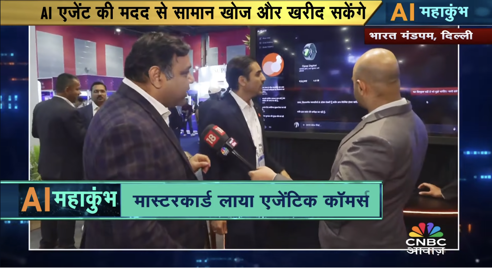

# Agentic Commerce — ArthaAI

> **AI agents that search, decide, and shop for you — autonomously and trustlessly.**

---

## What Is This?

**ArthaAI** is a demonstration of **Agentic Commerce** — a paradigm where AI agents act as autonomous shopping assistants that understand your intent, search products across the web, compare options, and complete purchases on your behalf, all without manual intervention at each step.

I built this at **Mastercard** and presented it at the **India AI Impact Summit 2026** (Bharat Mandapam, New Delhi) — showcasing what the next generation of e-commerce looks like: not a search bar, but an agent that thinks.

---

## Demo

**[Watch the full ArthaAI demo →](https://www.youtube.com/watch?v=WJ_Ym5uyScE)**

---

## Key Capabilities

- **Intent understanding** — Accepts natural language requests ("buy me running shoes under ₹3000 with good reviews")
- **Autonomous web search** — Agent browses and retrieves product listings without human guidance
- **Product comparison** — Evaluates options against user criteria: price, ratings, delivery time, brand
- **Trusted checkout** — Completes purchases securely via Mastercard's payment infrastructure
- **Multi-step reasoning** — Handles follow-up decisions and edge cases mid-flow without re-prompting
- **Multilingual support** — Understands and responds across multiple languages, making it accessible to a wider audience
- **Voice interaction** — Talk to the agent naturally using audio; no typing required
- **Transparency** — Shows its reasoning and actions so users stay in control

---

## Why "Agentic Commerce"?

Traditional e-commerce puts the burden on the user — you search, filter, compare, and decide. Agentic commerce inverts this: you state what you want, and the agent handles everything downstream.

Three principles guided this project:

1. **Trust** — An AI that spends your money must operate within clear, enforceable guardrails. Mastercard's payment infrastructure provides exactly that foundation.
2. **Control** — Users must be able to intervene, correct, or stop the agent at any point. Autonomy without oversight isn't a feature, it's a risk.
3. **Simplicity** — The best interface is no interface. The agent should feel less like a tool you operate and more like a person you can delegate to.

---

## Media Coverage

Featured across major Indian financial news outlets at the **India AI Impact Summit 2026**.

| Outlet | Coverage |
|---|---|
| CNBC Awaaz | [Watch — "Mastercard ने बदल दी Shopping"](https://www.youtube.com/watch?v=pawO9OscEyY) |
| India AI Impact Summit — Full Presentation | [Watch](https://www.youtube.com/watch?v=u5r9efYgb_M) |
| ArthaAI Live Demo | [Watch](https://www.youtube.com/watch?v=WJ_Ym5uyScE) |

---

## About

I'm **Shivam Arora**, and I built ArthaAI as part of my work at **Mastercard**.  
This project was presented at the **India AI Impact Summit 2026**, Bharat Mandapam, New Delhi, and was picked up by CNBC Awaaz as a signal of where AI-powered commerce is headed.

---

## License

MIT
